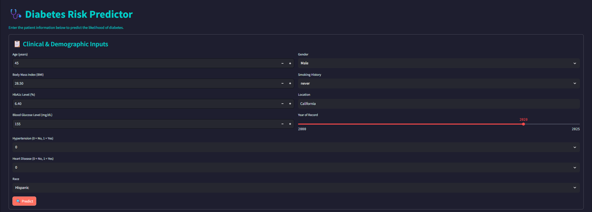

# 🩺 Diabetes Risk Predictor — Health Risk App (Streamlit App)
**Author:** Lakshay Yadav   

---

## 🎯 PROJECT OVERVIEW  
**Diabetes Risk Predictor** is a Streamlit-based web app that predicts whether a user is likely to have diabetes based on several health-related inputs. This project uses trained machine learning models and a dynamic Streamlit interface to generate real-time, user-driven predictions.

---

## 🌟 FEATURES  
🔢 Binary Classification for Diabetes Risk  
🧾 Input form for user health metrics (Age, BMI, Glucose, etc.)  
📊 Feature Importance Visualization (Bar chart)  
📄 PDF Report Generation with Model Output  
🧼 Preprocessed and scaled inputs using saved pipeline  
🚀 Fully deployable on Streamlit Cloud  

---

## 📁 PROJECT STRUCTURE  
diabetes-risk-predictor/  
├── app.py                       # Streamlit app  
├── requirements.txt             # Dependencies for deployment   
├── lakshay_data/  
│   └── UI.png                   # UI preview screenshot  
└── README.md                    # Project documentation  

---

## 🧪 MACHINE LEARNING PIPELINE  
**1. Phase 1: EDA & Preprocessing**  
- Loaded diabetes dataset from public source  
- Cleaned and transformed features  
- Scaled numerical variables using StandardScaler  
- Split data into train-test sets  

**2. Phase 2: Model Development**  
- Tested models: Logistic Regression, Random Forest, Gradient Boosting  
- Used stratified cross-validation and ROC-AUC scoring  
- Final model: Gradient Boosting Classifier  
- Saved model and scaler using joblib  

**3. Phase 3: Deployment**  
- Developed Streamlit interface with input form  
- Integrated feature importance plot  
- Implemented PDF report generation  
- Deployed and tested on Streamlit Cloud  

---

## ⚠️ CHALLENGES FACED  

❌ **Inconsistent Race Label Formatting**  
Variations like `"African American"` vs `"AfricanAmerican"` caused encoding issues.  
🛠️ *Resolved by standardizing all race labels before encoding.*

❌ **Sparse Matrix Error during PCA**  
PCA couldn't handle sparse matrices returned from the preprocessor.  
🛠️ *Fixed by converting the matrix to dense using `.toarray()` before PCA transformation.*

❌ **Encoder Failure Due to Missing 'diabetes' Column**  
The encoder expected the target column `diabetes` during `.transform()`, causing errors during prediction.  
🛠️ *Added a dummy column `diabetes = 0` at inference time to match encoder expectations.*

❌ **Feature Mismatch During Inference**  
The model crashed if encoded features didn’t perfectly align with training features.  
🛠️ *Added logic to fill missing columns with zero and reorder them to match training schema.*


---

## 💻 HOW TO RUN LOCALLY  

```bash
# Step 1: Clone the main SDS challenge repository
git clone https://github.com/SuperDataScience-Community-Projects/SDS-CP011-diabetes-predictor.git
cd SDS-CP011-diabetes-predictor/submissions/community-contributions/lakshay_yadav

# Step 2: (Optional) Create a virtual environment
python -m venv venv
source venv/bin/activate  # On Windows: venv\Scripts\activate

# Step 3: Install dependencies
pip install -r requirements.txt

# Step 4: Run the Streamlit app
streamlit run app.py
```

---

## 📷 UI PREVIEW  
  

---

## 🌐 DEPLOYMENT LINK  
You can try the live Diabetes Risk Predictor app here:  
🔗 https://yadavlakshay-cp11-deployment-app-34llpn.streamlit.app/

---

## 📄 LICENSE  
This project is created under SDS-CP011 for educational and demonstration purposes. All models and code are created by Lakshay Yadav.
